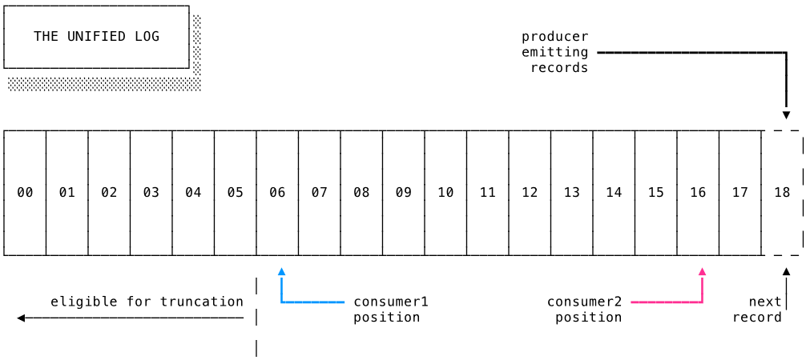
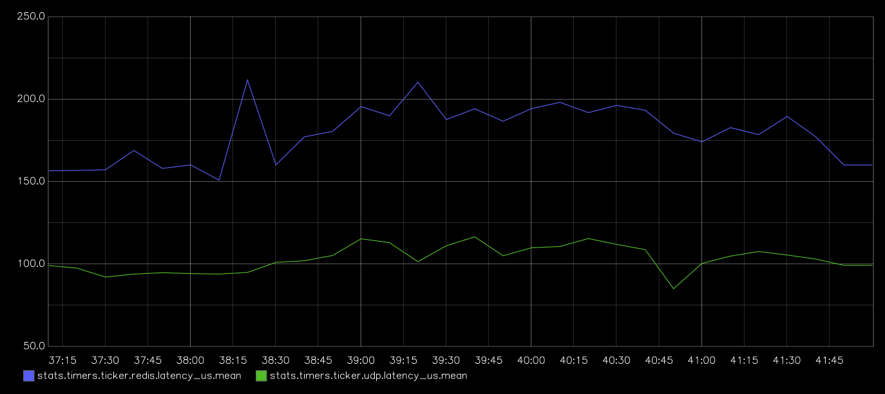

Motivation
===

Can we get market data in a public cloud environment?

<!-- pause -->

## Working with high frequency trading infrastructure is challenging
* CBOE exchange can easily output over 30gbps during peak market hours
* Decisions are very latency sensitive (fractions of a fraction of a millisecond matter)
* The exchange talks over multicast, which isn't supported in a normal cloud VPC

<!-- end_slide -->

Typical Architecture
===

## Let's about a common architecture

<!-- pause -->

```d2 +render
direction: right

network layer: Network Layer {
  NASDAQ -> Normalizer: ITCH (multicast)
  NYSE -> Normalizer: XDP (multicast)
}

consumer a: Consumer Process {
  udp listener -> tui thread: rust channel\n(decouples read from render)
}

consumer b: Consumer Process {
  udp listener -> tui thread: rust channel\n(decouples read from render)
}


network layer.Normalizer -> consumer a.udp listener: multicast UDP
network layer.Normalizer -> consumer b.udp listener: multicast UDP
```

<!-- end_slide -->

Quick Simple Stock Ticker with UDP
===


<!-- column_layout: [2, 2]-->

<!-- column: 0 -->

```bash +exec +pty
cd stock-ticker-tui && cargo run -- --source udp
```

<!-- column: 1 -->

```bash +exec +pty
cd stock-ticker-tui && cargo run -- --source udp
```

<!-- end_slide -->

How well does this approach work?
===

## Pros
* This is very fast! 
* With everything close and on the network, latency issue is well mitigated

<!-- pause -->

When exploring the public cloud, it's not a matter of going faster, but what you're
willing to pay in latency to get hypervisor benefits.

<!-- pause -->

## There are some problems
* VPC's don't support multicast..

<!-- pause -->

## What if a packet is missed? 
* When building an order book, messages can't be skipped
* If a gap is detected, ask the exchange to resend messages
* Protocol for these requests change with each exchange
* Different cadences depending on how far behind you are


<!-- end_slide -->

Redis Streams & Consumer Groups
===

## How Redis Streams solves these problems

<!-- pause -->

* Redis uses TCP connections, no multicast required
* Messages are persisted in the stream
* If a consumer disconnects and reconnects, it can resume from where it left off with `XREADGROUP`
* Multiple consumer groups can independently read the same stream, without blocking others

<!-- pause -->



<!-- end_slide -->

Alternate Architecture
===

## Now for the alternative

<!-- pause -->

```d2 +render
direction: right

network layer: Network Layer {
  NASDAQ -> Normalizer: ITCH (multicast)
  NYSE -> Normalizer: XDP (multicast)
  Normalizer -> "Redis Stream": XADD
}

consumer a: Consumer Process {
  stream listener -> tui thread: rust channel\n(decouples read from render)
}

consumer b: Consumer Process {
  stream listener -> tui thread: rust channel\n(decouples read from render)
}

network layer."Redis Stream" -> consumer a.stream listener: XREADGROUP\n(unicast TCP)
network layer."Redis Stream" -> consumer b.stream listener: XREADGROUP\n(unicast TCP)
```

<!-- end_slide -->

Quick Simple Stock Ticker with Redis Streams
===

<!-- column_layout: [2, 2]-->

<!-- column: 0 -->

```bash +exec +pty
cd stock-ticker-tui && cargo run -- --source redis
```

<!-- column: 1 -->

```bash +exec +pty
cd stock-ticker-tui && cargo run -- --source redis
```

<!-- end_slide -->

What about latency?
===

<!-- pause -->

## How I measured
* Used a nanosecond timestamp from the ITCH format to stamp each message
* Upon receipt, take a new timestamp, difference is the latency
* channel ensures we aren't blocking new messages with terminal render
* Everything is contained locally, no out of network hops

<!-- pause -->
## Caveats
* This is all one on local machine, doesn't account for network latency.

<!-- pause -->

## Results
Roughly an 80ns increase in latency, up from ~100ns to ~180ns

<!-- pause-->



<!-- end_slide -->

Is that good enough?
===

For a legacy brokerage trying to connect cloud services, the answer is:
* It depends
* NYSE liked this idea enough to expose their own Kafka stream with roughly 100ms of latency
* Maybe good enough for an application built for investors, but maybe not for quant trading.

<!-- pause -->

### Is this useful for anything else?

<!-- pause -->

This is still an extremely performant fan-out, useful for:

* Collecting IOT messages
* Application telemetry
* Multiplayer games

<!-- end_slide -->

Thank you!
===

Thanks for listening!  


